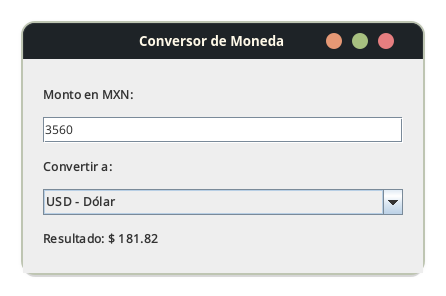

# Conversor de Moneda MXN

Este proyecto es una aplicación de escritorio en Java (Swing) que convierte pesos mexicanos (MXN) a dólares (USD), euros (EUR) y yenes japoneses (JPY), utilizando tasas de cambio **en tiempo real** obtenidas desde la API pública de [AwesomeAPI](https://economia.awesomeapi.com.br/).

## Características

- Conversión dinámica al escribir el monto o cambiar la moneda.
- Tasas actualizadas desde Internet (no valores fijos).
- Interfaz simple y moderna usando Java Swing.
- Cálculo especial para conversión MXN → JPY vía USD.

## Dependencias

- Java 8 o superior
- [org.json (JSON-java)](https://github.com/stleary/JSON-java)

## Captura

   <!-- Puedes agregar la imagen real cuando la tengas -->

-------------
Desarrollado por [OrionBlack].
